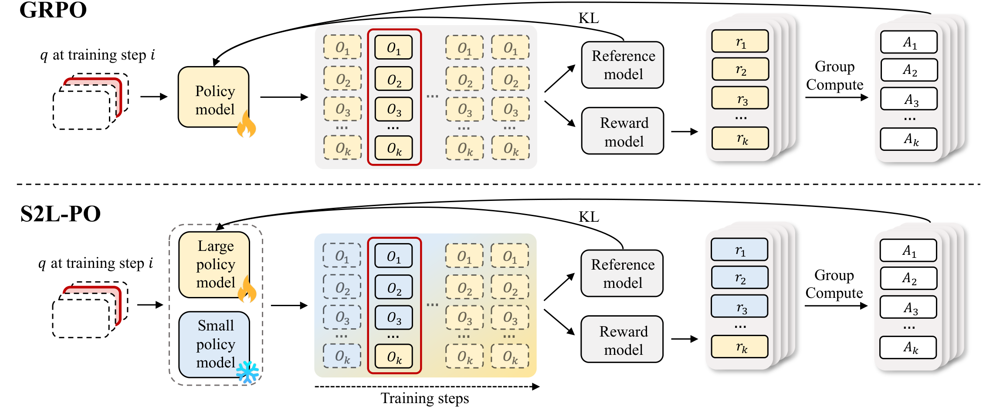

# Smaller Models are Natural Explorers for Policy-Level Diversity in GRPO

<div align="center">

[](https://arxiv.org/abs/XXXX.XXXXX)
[](https://YOUR_PROJECT_PAGE_URL)
[](https://huggingface.co/collections/YOUR_HF_COLLECTION)
[](LICENSE)

**ICML 2026**

[Yiming Ren]()\*, [Yiran Xu]()\*, [Zicheng Lin]()\*, [Chufan Shi](), [Yukang Chen](), [Dingdong Wang](), [Tianhe Wu](), [Jujie Wang](), [Yujiu Yang](), [Yu Qiao]()†, [Ruihang Chu]()†

\*Equal contribution  &emsp; †Corresponding authors

</div>

---

## Why S2L-PO?

Modern LLMs benefit enormously from reinforcement learning post-training (e.g., GRPO), but standard on-policy rollouts suffer from **low policy-level diversity**: all candidate solutions are sampled from the same model at the same training step, leading to mode collapse and slow policy improvement.

**S2L-PO (Small-to-Large Policy Optimization)** addresses this from a fresh angle. Rather than increasing *token-level* stochasticity (higher temperature), which accumulates decoding errors over long reasoning chains, we inject **policy-level diversity** by using a *smaller model from the same family* as an explorer:

- The smaller model generates a fraction of the rollout group, providing qualitatively different reasoning trajectories.
- The larger (target) model is trained on the full mixed-rollout group via standard GRPO.
- A **progressive annealing** schedule transitions from small-model exploration to fully on-policy learning, combining exploration in early training with stable fine-tuning later.

This is both principled and practical: the small explorer is only used during rollout (not gradient computation), so **the overhead is minimal** while the diversity gains are substantial.

<div align="center">

</div>

### Key Results

All models are evaluated in `nothink` mode following the [Qwen3 technical report](https://huggingface.co/Qwen/Qwen3-8B).

| Setting | Method | AIME24 Pass@1 | AIME25 Pass@1 |
|---------|--------|:---:|:---:|
| Qwen3-8B learner | GRPO (baseline) | 15.0 | 12.1 |
| Qwen3-8B learner | **S2L-PO (1.7B explorer)** | **23.8** | **22.5** |
| Qwen3-8B learner | **S2L-PO (4B explorer)** | **19.1** | **13.3** |
| Qwen3-14B learner | GRPO (baseline) | 18.0 | 12.9 |
| Qwen3-14B learner | **S2L-PO (4B explorer)** | **24.4** | **14.6** |

Using a 1.7B model to guide an 8B learner yields an **average +9% gain** over vanilla GRPO on AIME, while adding only marginal computational overhead. On out-of-domain (CommonsenseQA) evaluations, S2L-PO matches or slightly improves over GRPO, demonstrating that the gains do **not** sacrifice general reasoning ability.

---

## Released Models

We release the final checkpoints of the Qwen3-series S2L-PO learner models:

| Model | HuggingFace | Explorer | Learner |
|-------|-------------|----------|---------|
| Qwen3-8B-S2L-PO-1.7Bexplorer | [🤗 Link](https://huggingface.co/YOUR_HF_ID/Qwen3-8B-S2L-PO-1.7Bexplorer) | Qwen3-1.7B-Base | Qwen3-8B-Base |
| Qwen3-8B-S2L-PO-4Bexplorer | [🤗 Link](https://huggingface.co/YOUR_HF_ID/Qwen3-8B-S2L-PO-4Bexplorer) | Qwen3-4B-Base | Qwen3-8B-Base |
| Qwen3-14B-S2L-PO-4Bexplorer | [🤗 Link](https://huggingface.co/YOUR_HF_ID/Qwen3-14B-S2L-PO-4Bexplorer) | Qwen3-4B-Base | Qwen3-14B-Base |

> **Note:** Model weights will be made publicly available upon acceptance notification. Stay tuned!

---

## Environment Setup

### Requirements

- Python ≥ 3.10
- CUDA ≥ 12.1
- GPU memory: ~20 GB per 8B model, ~32 GB per 14B model

### Installation

```bash
pip install vllm>=0.8.0 transformers>=4.51.0 tqdm
```

For a complete reproducible environment:

```bash
conda create -n s2l-po python=3.11 -y
conda activate s2l-po
pip install "vllm>=0.8.4" "transformers>=4.51.0" tqdm
```

---

## Evaluation

All evaluation code lives in [`eval/`](eval/). The pipeline has three stages:

1. **Inference** — generate *k* candidate solutions per question using vLLM
2. **Answer Extraction** — parse `\boxed{}` or numeric answers from raw outputs
3. **Scoring** — compute Pass@k using the unbiased estimator

### Quick Start

```bash
cd eval

# Evaluate a single model on AIME24 + AIME25 (32 samples per question)
python run_evaluation.py \
    --model_path /path/to/Qwen3-8B-S2L-PO-1.7Bexplorer \
    --mode nothink \
    --k 32 \
    --benchmarks aime24 aime25

# View results
cat result/Qwen3-8B-S2L-PO-1.7Bexplorer_<timestamp>/summary.json
```

### Evaluate All Three Models in Parallel

```bash
cd eval
bash eval_s2l_po.sh /path/to/release 32 nothink
```

This launches one process per GPU and evaluates all three models simultaneously.

### Parameter Reference

| Argument | Default | Description |
|----------|---------|-------------|
| `--model_path` | — | Local path or HuggingFace model ID |
| `--mode` | — | `think` (thinking mode) or `nothink` |
| `--k` | 10 | Samples per question for Pass@k |
| `--benchmarks` | all | Space-separated list: `aime24 aime25 math500 olympiadbench` |
| `--tensor_parallel_size` | 1 | Number of GPUs for tensor parallelism |
| `--gpu_memory_utilization` | 0.9 | vLLM GPU memory fraction |

### Supported Benchmarks

| Benchmark | # Problems | Domain |
|-----------|:----------:|--------|
| AIME 2024 | 30 | Competition mathematics |
| AIME 2025 | 30 | Competition mathematics |
| MATH-500 | 500 | High-school to competition math |
| OlympiadBench | 675 | International olympiad problems |
| CommonsenseQA | 1221 | Out-of-domain commonsense (OOD) |

### Preparing Benchmark Data

Benchmark data files are **not included** in this repository. Please download them from their original sources and place them under `eval/data/`:

```
eval/data/
├── aime24.jsonl          # AIME 2024 — from DAPO / AoPS
├── aime25.jsonl          # AIME 2025 — from DAPO / AoPS
├── math500.jsonl         # MATH-500 — from hendrycks/competition_math
├── olympiadbench.jsonl   # OlympiadBench — from https://github.com/OpenBMB/OlympiadBench
└── commonsenseqa.jsonl   # CommonsenseQA — from https://www.tau-benchmark.com
```

Each file should be in JSONL format with at minimum `"question"` and `"answer"` fields per line.

### Sampling Configurations

Following the Qwen3 technical report:

| Mode | Temperature | Top-p | Top-k | Presence Penalty |
|------|:-----------:|:-----:|:-----:|:----------------:|
| `think` | 0.6 | 0.95 | 20 | 0.0 |
| `nothink` | 0.7 | 0.8 | 20 | 1.5 |

> We evaluate in `nothink` mode in the paper. The `think` mode typically yields higher single-sample accuracy but at greater token cost.

### Output Format

```
eval/
├── output/<model>_<timestamp>/
│   ├── config.txt            # run configuration
│   ├── aime24_raw.jsonl      # raw model generations
│   ├── aime24.jsonl          # extracted answers
│   └── ...
└── result/<model>_<timestamp>/
    ├── aime24.json           # per-benchmark scores
    ├── aime25.json
    ├── math500.json
    └── summary.json          # full Pass@k table
```

---

## Citation

If you find this work useful, please cite:

```bibtex
@inproceedings{ren2026s2lpo,
  title     = {Smaller Models are Natural Explorers for Policy-Level Diversity in {GRPO}},
  author    = {Ren, Yiming and Xu, Yiran and Lin, Zicheng and Shi, Chufan and Chen, Yukang and
               Wang, Dingdong and Wu, Tianhe and Wang, Jujie and Yang, Yujiu and Qiao, Yu and Chu, Ruihang},
  booktitle = {International Conference on Machine Learning (ICML)},
  year      = {2026},
}
```

---

## License

This project is released under the [Apache 2.0 License](LICENSE).
